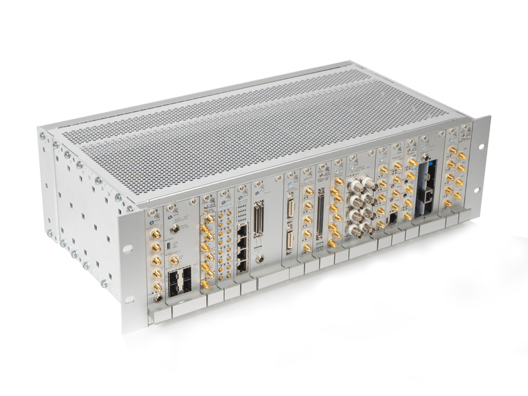
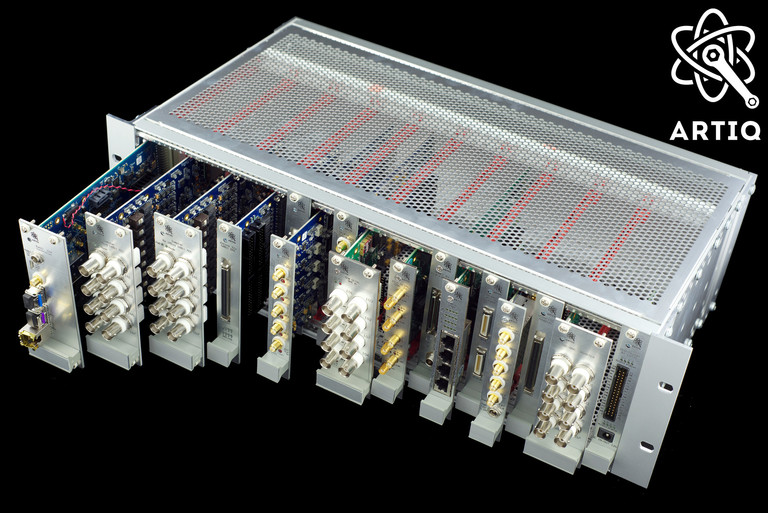
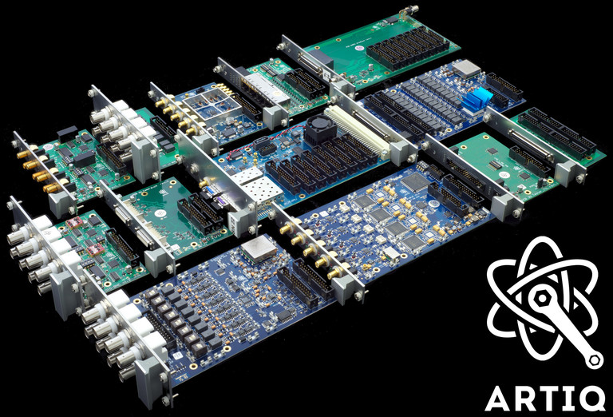

Sinara is an open-source (CERN OHL v1.2) hardware ecosystem designed by physicists for use in quantum science laboratories largely focused on work with trapped atomic ion qubits. Sinara is designed to work closely with the [ARTIQ](https://m-labs.hk/artiq/) control software. While Sinara and ARTIQ were founded by a particular niche in the experimental physics community, users and contributors from all disciplines are invited to use and contribute to the project. 

Control electronics used in many atomic physics laboratories suffers from a number of problems. Control solutions developed in-house by physicists often optimize for lab-specific needs and the publish-or-perish reality of many PIs circumstances. The result is solutions that compromise on architectural design, reproducibility, testing and documentation which translates into systems that are fragile, difficulty to reproduce in other labs and hard to maintain. It also duplicates similar infrastructural work undertaken in other laboratories. Further, the performance and feature set of commercial off the shelf hardware-software solutions is poorly matched to many labs needs (e.g. RF pulse shaping, branching latency). 

To alleviate those problems, Sinara _aims_ to be:

- fully transparent design workflow 
- open source hardware, firmware and unit tests
- simple to use and "turn-key" (we're not quite "turn-key" yet) 
- reproducible 
- flexible and modular
- well tested at the hardware level
- well supported by the ARTIQ control software

Sinara was developed by a [collaboration](team) including M-Labs, QUARTIQ, Warsaw University of Technology (WUT), US Army Research Laboratory (ARL), the University of Oxford, the University of Maryland, the University of Oregon, and NIST -- the list of contributors has grown beyond this core group as of 2023. The majority of the hardware was designed by WUT. The work was funded by ARL, Duke University, the University of Oxford, the University of Oregon, and the University of Freiburg -- the list of funders has grown beyond this core group as of 2023.

Currently, much of this hardware is well tested, commercially available and deployed for routine use in many AMO labs. Information about the hardware and firmware/software status of the various hardware projects making up Sinara can be found [here](Status). Options for purchasing Sinara hardware can be found [here](Purchasing). 

# Overview

Following the ARTIQ model, a minimal laboratory setup consists of a core device  -- typically [Kasli](https://github.com/sinara-hw/Kasli/wiki) or [Kasli-SOC](https://github.com/sinara-hw/Kasli-soc/wiki) -- controlling multiple satellite devices in real time using the ARTIQ [distributed real-time IO](https://github.com/m-labs/artiq/wiki/DRTIO) (DRTIO) protocol. DRTIO provides both gigabit communication links and time distribution over copper cable or optical fiber. It synchronizes all device clocks, ensuring they have deterministic phase relationships, and enables nanosecond timing resolution for input and output events across all devices in the experiment. More detailed information about communication between devices and time distribution inside Sinara can be found [here](SinaraClocking).

In Sinara systems, the _core device_ provides power, configuration (using [kasli-i2c](https://github.com/quartiq/kasli-i2c)) and DRTIO to real-time peripherals. Sinara uses two main core device form factors: microTCA (uTCA) and Eurocard Extension Modules (EEM) -- as of 2023 the EEM form factor is vastly dominant.  
* In the case of EEM, the core device is resides in a 3U Eurocard-style rack and connects to other Sinara real-time peripherals using ribbon cables. More details about the extension module standard can be found [here](EEM). Non real-time hardware is typically connected to the host PC using USB or Ethernet.
* uTCA hardware interfaces with the extension modules either directly, using a [VHDCI carrier](https://github.com/sinara-hw/VHDCI_Carrier/wiki), or indirectly, using a [Kasli](https://github.com/sinara-hw/Kasli/wiki) DRTIO satellite.

## form factor: MicroTCA hardware

An overview of uTCA in Sinara can be found [here](uTCA), for more detailed information on specific topics, see the links below. The uTCA hardware is still in beta and not yet fullly supported by ARTIQ. See [this](https://github.com/sinara-hw/meta/wiki/Status) page for status. 

* [_uTCA Chassis_](uTCA_Chassis)
* [_Metlino_](https://github.com/sinara-hw/Metlino/wiki): uTCA MCH (rack master device)
* [_Sayma_](Sayma): 8 channel 2.4GSPS Smart Arbitrary Waveform Generator
* [Sayma analogue front-end mezzanines](SaymaAFE)
* [uTCA misc](uTCAMisc): mainly adapters and test harnesses

## form factor: EEM

* Information about the Eurocard Extension Module (EEM) standard can be found [here](EEM). Note that EEM was devised by the Sinara project. 
* To provision Sinara hardware (flash) use [kasli-i2c](https://github.com/quartiq/kasli-i2c). 
* To test systems built from Sinara hardware use [kasli_tester.py](https://github.com/m-labs/artiq/blob/master/artiq/examples/kasli/repository/kasli_tester.py).

### Kasli family of EEM core devices
* [Kasli](https://github.com/sinara-hw/Kasli/wiki)
* [Kasli-soc](https://github.com/sinara-hw/Kasli-SOC/wiki)
* [VHDCI carrier](https://github.com/sinara-hw/VHDCI_Carrier/wiki)

### EEM extension modules
Note that not all PCBs in this section are fully debugged and supported by ARTIQ. See [this](https://github.com/sinara-hw/meta/wiki/Status) page for status. 
* [DIO_BNC](https://github.com/sinara-hw/DIO_BNC/wiki): Digital IO on BNCs  
* [DIO_SMA](https://github.com/sinara-hw/DIO_SMA/wiki): Digital IO on SMAs  
* [DIO_RJ45](https://github.com/sinara-hw/DIO_RJ45/wiki): LVDS IO on RJ45s  
* [Zotino](https://github.com/sinara-hw/Zotino/wiki): 32-channel DAC  
* [Sampler](https://github.com/sinara-hw/Sampler/wiki): 8-channel ADC  
* [Grabber](https://github.com/sinara-hw/Grabber/wiki): Camera Framegrabber 
* [Mirny](https://github.com/sinara-hw/Mirny/wiki): Quad Microwave Synthesiser  
* [Urukul](https://github.com/sinara-hw/Urukul/wiki): Quad DDS  
* [Clocker](https://github.com/sinara-hw/Clocker/wiki): Clock Buffer   
* [Humpback](https://github.com/sinara-hw/Humpback/wiki): SBC baseboard with FPGA
* [Stabilizer](https://github.com/sinara-hw/Stabilizer/wiki): Dual channel fast servo
* [Banker](https://github.com/sinara-hw/Banker/wiki): FPGA-based 128x GPIO with adapters
* [Fastino](https://github.com/sinara-hw/Fastino/wiki): Fast  32-channel DAC

## Sinara support hardware

Other supporting hardware, not requiring real-time control from the ARTIQ master:

* [Booster](https://github.com/sinara-hw/Booster/wiki): RF Power Amplifier
* [Thermostat](https://github.com/sinara-hw/Thermostat/wiki): Temp Controller

## Sinara adapters and breakout hardware

* [SATA to SFP](https://github.com/sinara-hw/SATA_SFP/wiki)
* [BNC to IDC](https://github.com/sinara-hw/BNC_IDC/wiki)
* [SMA to IDC](https://github.com/sinara-hw/SMA_IDC_Adapter)
* [HD68 to IDC](https://github.com/sinara-hw/IDC_HD68_Adapter/wiki)
* [VHDCI to EDGE Buffered](https://github.com/sinara-hw/Banker_VHDCI_2_EDGE_Buffered)
* [VHDCI to EDGE](https://github.com/sinara-hw/Banker_VHDCI_2_EDGE)
* [BNC to EDGE](https://github.com/sinara-hw/Banker_EDGE_2_BNC)
* [DSUB9 to EDGE](https://github.com/sinara-hw/Banker_EDGE_2_DSUB)
* [SMA to EDGE](https://github.com/sinara-hw/Banker_EDGE_2_SMA)
* Screw terminal to EDGE
* [CPCIS to EEM adapter](https://github.com/sinara-hw/CompactPCISerial_EEM_Adapter/wiki)
* [Kasli Backplane to EEM adapter](https://github.com/sinara-hw/Kasli-backplane-adapter/wiki)

# Project structure and development

Development discussions take place on two forums: the GitHub issue trackers for well-defined actionable items; and the [web forum](https://forum.m-labs.hk) for more vague questions, general brainstorming, new hardware proposals, discussions about funding, and so forth.

Two main CAD tool used for PCB design within Sinara is _Altium Designer_. Altium Designer is preferred for more complex designs, such as the uTCA and EEM hardware. Kicad is also used for simple designs, like adapters, in particular, those intended to be modifiable by the users (physicists). 

A list of future hardware ideas can be found [here](PlannedHardware). 

# Talks and Posters

* [Greg's NACTI poster](talks/poster_NACTI.pdf)
* [Paweł's master thesis proposal talk](talks/pawel_kasli_mgr2.pdf)
* [Robert's poster](https://quartiq.de/talks/ARTIQ_Sinara.pdf)
* [IEEE International Conference on Quantum Computing and Engineering (QCE20) Poster](https://github.com/sinara-hw/meta/files/5368750/ARTIQ_Sinara_final_small.pdf)
* [ A paper about Urukul](http://ijet.pl/index.php/ijet/article/download/10.24425-ijet.2022.139859/937)
* [ A paper about SAWG ](https://ieeexplore.ieee.org/abstract/document/9605342)
* [ ECTI 2023 poster about DIOT ](https://github.com/sinara-hw/meta/files/12801670/ECTI_DIOT_RC8.pdf)
* [ Control system for ion Penning traps at the AEgIS experiment at CERN - A paper about ARTIQ&Sinara in anti-matter trap at CERN](https://iopscience.iop.org/article/10.1088/1742-6596/2374/1/012038/meta)